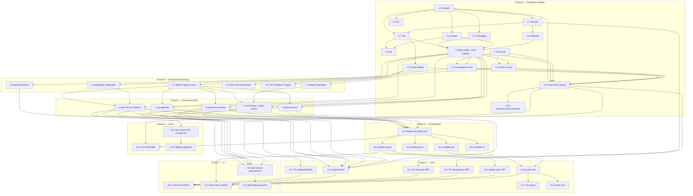

# Implementation Plan: AWS Academy Deployment

## Overview

This plan converts the approved `design.md` into an ordered, coding-only checklist that provisions the Arch Analyzer stack on AWS Academy. Work is grouped by phase:

- **Phase A** — Terraform modules under `c:\projects\fiap-arch-analyzer-infra\modules\` (extend existing, add `secrets`, `observability`, `mongodb-on-eks`, `redis-on-eks`), root `main.tf` wiring, and `terraform.tfvars.example` extension.
- **Phase B** — Shared Kubernetes cluster bootstrap driven from Terraform (NGINX Ingress, MongoDB, Redis, Fluent Bit, CloudWatch Container Insights, default-deny + allow NetworkPolicies, `infra-outputs` ConfigMap).
- **Phase C** — Per-service `k8s/` folders inside each Service_Repo, matching the canonical contract from `fiap-arch-analyzer-auth-service/k8s/`. Also refactors the existing auth-service folder to drop hardcoded AWS values and match the contract.
- **Phase D** — Deployment_Orchestrator + Validator (`scripts/deploy-all.config.yaml`, `scripts/deploy-all.{ps1,sh}`, `scripts/validate.{ps1,sh}`) inside the Infra_Repo.
- **Phase E** — Terraform static analysis, `kubeconform` manifest validation, Hypothesis property tests, smoke / end-to-end / chaos integration tests.
- **Phase F** — GitHub Actions pipelines: Infra_Repo (validate / plan / infracost / apply / smoke) and per-Service_Repo (kubeconform + AWS-literal guardrail).
- **Phase G** — README updates, per-service contract doc, rollback playbook.

Every leaf task cites the acceptance criteria it fulfils (`_Requirements: X.Y, Z.W_`).

## Dependency Overview (Mermaid)



## Tasks

- [x] 1. Phase A — Terraform modules and root wiring
  - Extend existing modules under `c:\projects\fiap-arch-analyzer-infra\modules\` and add the four new modules (`secrets`, `observability`, `mongodb-on-eks`, `redis-on-eks`). Each sub-task authors `main.tf`, `variables.tf`, and `outputs.tf` inside the module directory.

  - [x] 1.1 Implement the `network` module (`c:\projects\fiap-arch-analyzer-infra\modules\network\`)
    - Create VPC `10.0.0.0/16`, two public subnets (`10.0.1.0/24`, `10.0.2.0/24`) and two private subnets (`10.0.3.0/24`, `10.0.4.0/24`) across `us-east-1a` / `us-east-1b`.
    - Attach one Internet Gateway and public-subnet route tables with a `0.0.0.0/0` → IGW route; no NAT Gateway.
    - Add one S3 Gateway VPC Endpoint associated with both public and private route tables.
    - Enable VPC Flow Logs to CloudWatch using `lab_role_arn` as the delivery role.
    - Tag public subnets with `kubernetes.io/role/elb=1` and private subnets with `kubernetes.io/role/internal-elb=1` and `kubernetes.io/cluster/<cluster_name>=shared`.
    - Expose `vpc_id`, `vpc_cidr`, `public_subnet_ids`, `private_subnet_ids` as outputs.
    - _Requirements: 1.1, 1.2, 1.3, 1.4, 1.5, 1.6, 1.7, 18.6_

  - [x] 1.2 Implement the `security` module (`c:\projects\fiap-arch-analyzer-infra\modules\security\`)
    - Create `alb_security_group`, `eks_nodes_security_group`, `rds_security_group`.
    - ALB SG: ingress TCP/80 from `alb_ingress_cidrs` only; egress unrestricted.
    - EKS nodes SG: ingress TCP/30000-32767 only by SG reference to `alb_security_group`; egress TCP/80 + TCP/443 to `0.0.0.0/0`; optional TCP/22 ingress from `allowed_ssh_cidrs` when non-empty.
    - RDS SG: ingress TCP/5432 only by SG reference to `eks_nodes_security_group`.
    - Encode the least-privilege invariant as a Terraform `check` block: reject any `0.0.0.0/0` ingress rule that does not target ALB SG on port 80.
    - Expose `alb_security_group_id`, `eks_nodes_security_group_id`, `rds_security_group_id` as outputs.
    - _Requirements: 2.1, 2.2, 2.3, 2.4, 2.5, 2.6, 2.7_

  - [x] 1.3 Implement the `storage` module (`c:\projects\fiap-arch-analyzer-infra\modules\storage\`)
    - Create Diagrams_Bucket `arch-analyzer-diagrams-<env>-<suffix>` and Access_Logs_Bucket with randomised suffixes, both with `block_public_access=true`.
    - Enable SSE (`aws:kms` when a CMK is available, `AES256` fallback when `use_aws_managed_kms=true`) and versioning on Diagrams_Bucket.
    - Attach a bucket policy on Diagrams_Bucket that denies requests where `aws:SecureTransport=false`; attach the ALB log-delivery bucket policy to Access_Logs_Bucket scoped to its ARN.
    - Plumb `force_destroy` through to both buckets.
    - Expose `diagrams_bucket_id`, `access_logs_bucket_id` as outputs.
    - _Requirements: 3.1, 3.2, 3.3, 3.4, 3.5, 3.6, 3.7, 17.5_

  - [x] 1.4 Implement the `ecr` module (`c:\projects\fiap-arch-analyzer-infra\modules\ecr\`)
    - Create one private ECR repository per entry in `repository_names` (`arch-analyzer-gateway`, `arch-analyzer-auth`, `arch-analyzer-registration`, `arch-analyzer-processing`, `arch-analyzer-report`).
    - Enable `image_scanning_configuration.scan_on_push=true` on every repository.
    - Plumb `force_delete` through to each repository.
    - Expose a map output `repository_urls` keyed by repository name.
    - _Requirements: 4.1, 4.2, 4.3, 4.4, 17.5_

  - [x] 1.5 Implement the `messaging` module (`c:\projects\fiap-arch-analyzer-infra\modules\messaging\`)
    - Create `arch-analyzer-processing-<env>` Standard SQS queue with `visibility_timeout_seconds=600` and SSE-SQS enabled.
    - Create `arch-analyzer-processing-dlq-<env>` DLQ with SSE-SQS enabled.
    - Wire `redrive_policy` on the main queue targeting the DLQ with `maxReceiveCount=3`.
    - Attach a queue policy on the main queue denying requests where `aws:SecureTransport=false`.
    - Expose `processing_queue_url`, `processing_queue_arn`, `dlq_url`, `dlq_arn` as outputs.
    - _Requirements: 5.1, 5.2, 5.3, 5.4, 5.5, 5.6_

  - [x] 1.6 Implement the `database` module (`c:\projects\fiap-arch-analyzer-infra\modules\database\`)
    - Create `aws_db_subnet_group` over the two private subnets and an `aws_db_instance` of engine `postgres` major version 15 on `db.t3.micro` with 20 GB `gp3` storage in single-AZ mode.
    - Set `publicly_accessible=false`, `storage_encrypted=true`, `iam_database_authentication_enabled=true`, `monitoring_interval=0`, `backup_retention_period=7`, `skip_final_snapshot=true` for non-production.
    - Accept and apply `rds_security_group_id` produced by the `security` module.
    - Expose `db_address`, `db_endpoint`, `db_port` as outputs.
    - _Requirements: 6.1, 6.2, 6.3, 6.4, 6.5, 6.6, 6.7, 6.8, 6.9, 17.5, 18.4_

  - [x] 1.7 Implement the `eks` module (`c:\projects\fiap-arch-analyzer-infra\modules\eks\`)
    - Create `arch-analyzer-<environment>` EKS cluster referencing `lab_role_arn`; enable `api`, `audit`, `authenticator` control-plane logs; restrict the public API endpoint to `eks_public_access_cidrs`.
    - Create one managed node group with `instance_types=["t3.small"]`, `desired_size=2`, `min_size=1`, `max_size=5`, referencing `lab_role_arn` as node role and attaching `eks_nodes_security_group` through its launch template.
    - Implement the CMK fallback: when `use_aws_managed_kms=true` or CMK creation raises `AccessDenied`, set `encryption_config.provider.key_arn = alias/aws/eks`.
    - Do NOT create an `aws_iam_openid_connect_provider`.
    - Expose `cluster_name`, `cluster_endpoint`, `cluster_certificate_authority`, `cluster_security_group_id`, `node_group_asg_names` as outputs.
    - _Requirements: 7.1, 7.2, 7.3, 7.4, 7.5, 7.6, 7.7, 7.8, 18.1, 18.2, 18.5, 18.7_

  - [x] 1.8 Implement the `alb` module (`c:\projects\fiap-arch-analyzer-infra\modules\alb\`)
    - Create an internet-facing Application Load Balancer spanning both public subnets with `alb_security_group_id` attached.
    - Create one HTTP listener on port 80 forwarding to the NGINX Ingress target group; do NOT create an HTTPS listener.
    - Attach the target group to `node_group_asg_names` on NodePort 30080 with HTTP health check on `/healthz` (healthy=2, unhealthy=2).
    - Enable access logs to Access_Logs_Bucket under prefix `alb/`.
    - Expose `alb_dns_name`, `alb_arn`, `target_group_arn` as outputs.
    - _Requirements: 8.1, 8.2, 8.3, 8.4, 8.5, 8.6, 8.7, 18.3_

  - [x] 1.9 Extend the `k8s-config` module (`c:\projects\fiap-arch-analyzer-infra\modules\k8s-config\`) with namespaces, NetworkPolicies, NGINX ingress Helm release, and the `infra-outputs` ConfigMap
    - Create the namespaces `arch-analyzer-api`, `arch-analyzer-ia`, `auth`, and `data` using the `kubernetes` provider.
    - Apply a default-deny ingress `NetworkPolicy` in each application namespace (`arch-analyzer-api`, `arch-analyzer-ia`, `auth`).
    - Apply explicit allow NetworkPolicies for the flows `ingress-controller → api-gateway`, `api-gateway → {auth, registration, processing, report}`, `processing → celery-worker`, `{registration, processing, report} → data`.
    - Install the NGINX Ingress Controller through the `helm` provider using the `ingress-nginx/ingress-nginx` chart with `controller.service.type=NodePort` and `controller.service.nodePorts.http=30080`.
    - Publish one `kubernetes_config_map.infra_outputs` per application namespace (`for_each` over `arch-analyzer-api`, `arch-analyzer-ia`, `auth`) with exactly the keys `AWS_REGION`, `AWS_ACCOUNT_ID`, `CLUSTER_NAME`, `ALB_DNS_NAME`, `DB_ADDRESS`, `DB_PORT`, `DB_NAME`, `SQS_PROCESSING_QUEUE_URL`, `SQS_DLQ_URL`, `S3_DIAGRAMS_BUCKET`, `ECR_REGISTRY`, `ECR_REPOSITORY_URL_GATEWAY`, `ECR_REPOSITORY_URL_AUTH`, `ECR_REPOSITORY_URL_REGISTRATION`, `ECR_REPOSITORY_URL_PROCESSING`, `ECR_REPOSITORY_URL_REPORT`, casting numeric outputs (e.g. `DB_PORT`) via `tostring(...)`.
    - Stamp labels `app.kubernetes.io/part-of=arch-analyzer` and `app.kubernetes.io/managed-by=terraform` on the ConfigMap.
    - Reject any additional ConfigMap / Secret that would republish AWS Terraform outputs outside `infra-outputs`.
    - _Requirements: 9.1, 9.2, 9.3, 9.4, 9.5, 9.6, 22.1, 23.1, 23.2, 23.3, 23.4, 23.5, 23.7_

  - [x] 1.10 Add the new `secrets` module (`c:\projects\fiap-arch-analyzer-infra\modules\secrets\`)
    - Create one `aws_secretsmanager_secret` per path: `arch-analyzer/db/registration`, `arch-analyzer/db/processing`, `arch-analyzer/db/report`, `arch-analyzer/auth/mongo`, `arch-analyzer/auth/jwt`, `arch-analyzer/redis/password`, `arch-analyzer/llm/keys`, each with a matching `aws_secretsmanager_secret_version` populated from sensitive inputs.
    - Declare `db_password`, `jwt_signing_key`, `mongo_password`, `redis_password`, `llm_api_keys` (map) as `sensitive=true` variables.
    - Expose a `secret_arns` map output keyed by logical path.
    - Update `c:\projects\fiap-arch-analyzer-infra\.gitignore` to exclude `terraform.tfvars` and `*.tfstate*`.
    - _Requirements: 10.1, 10.2, 10.5, 10.7_

  - [x] 1.11 Add the new `observability` module (`c:\projects\fiap-arch-analyzer-infra\modules\observability\`)
    - Create `aws_cloudwatch_log_group` resources `/aws/eks/arch-analyzer/app` and `/aws/eks/arch-analyzer/system` with `retention_in_days=7`.
    - Define four `aws_cloudwatch_metric_alarm` resources: pod CPU > 80% for 5 min, node memory > 85% for 5 min, ALB `HTTPCode_Target_5XX_Count` threshold, `ApproximateNumberOfMessagesVisible` on Processing_DLQ > 0.
    - Define one `aws_cloudwatch_dashboard` with per-service widgets for CPU, memory, 5xx rate, and Processing_DLQ depth.
    - Expose `log_group_names` (map) and `alarm_arns` (list) as outputs.
    - _Requirements: 13.1, 13.4, 13.5, 13.6, 13.7, 13.8_

  - [x] 1.12 Add the new `mongodb-on-eks` module (`c:\projects\fiap-arch-analyzer-infra\modules\mongodb-on-eks\`)
    - Expose inputs `namespace`, `storage_class`, `storage_size`, `root_password_secret_name`.
    - Author a single-replica MongoDB 7 `StatefulSet` (via Helm `bitnami/mongodb` or `kubernetes_manifest` StatefulSet) in the `data` namespace with a `gp3`-backed PVC sized `10Gi`, root password supplied through the secret-sync init container pattern consuming `arch-analyzer/auth/mongo`.
    - Author a ClusterIP `Service` named `mongodb` on port 27017 in `data`.
    - Expose `service_host`, `service_port` outputs.
    - _Requirements: 11.1, 11.2, 11.3, 11.4, 11.5_

  - [x] 1.13 Add the new `redis-on-eks` module (`c:\projects\fiap-arch-analyzer-infra\modules\redis-on-eks\`)
    - Expose inputs `namespace`, `storage_class`, `storage_size`, `password_secret_name`.
    - Author a single-replica Redis `StatefulSet` (via Helm `bitnami/redis` or `kubernetes_manifest`) in the `data` namespace with a `gp3`-backed PVC sized `2Gi`, `AUTH` required, password sourced from `arch-analyzer/redis/password` through the secret-sync init container pattern.
    - Author a ClusterIP `Service` named `redis` on port 6379 in `data`.
    - Expose `service_host`, `service_port` outputs.
    - _Requirements: 12.1, 12.2, 12.3, 12.4, 12.5_

  - [x] 1.14 Wire every module in the root `main.tf` (`c:\projects\fiap-arch-analyzer-infra\main.tf`) and `c:\projects\fiap-arch-analyzer-infra\outputs.tf`
    - Add `module "secrets"`, `module "observability"`, `module "mongodb"`, `module "redis"` calls respecting the dependency edges (`secrets` before `mongodb`/`redis`; `k8s_config` before both; `eks` before `observability`).
    - Pass `ecr_repository_urls`, `db_address`, `db_port`, `db_name`, `sqs_processing_queue_url`, `sqs_dlq_url`, `s3_diagrams_bucket`, `alb_dns_name`, `aws_region` into the `k8s-config` module so it can populate `infra-outputs`.
    - Re-expose cluster name, ALB DNS, and ECR repository URLs as root outputs for the orchestrator (`eks_cluster_name`, `alb_dns_name`, `ecr_repository_urls`).
    - Lock `provider "aws"` to `region = "us-east-1"`.
    - _Requirements: 18.1, 18.6, 22.1_

  - [x] 1.15 Extend `terraform.tfvars.example` (`c:\projects\fiap-arch-analyzer-infra\terraform.tfvars.example`)
    - Add placeholders for `db_password`, `jwt_signing_key`, `mongo_password`, `redis_password`, `llm_api_keys` (map with `OPENAI_API_KEY`, `ANTHROPIC_API_KEY`, optional `HF_API_TOKEN`), and `eks_public_access_cidrs` (default workstation IP).
    - Add a banner comment reminding the user that the real `terraform.tfvars` must never be committed.
    - _Requirements: 10.2, 10.7, 7.3_

- [x] 2. Phase B — Shared Kubernetes cluster bootstrap from Terraform
  - Ensure the Terraform modules from phase A render the shared cluster primitives. These sub-tasks author the concrete Helm / `kubernetes_manifest` resources inside the existing modules.

  - [x] 2.1 Author the NGINX Ingress Controller Helm release inside `c:\projects\fiap-arch-analyzer-infra\modules\k8s-config\main.tf`
    - Use the `helm_release` resource with chart `ingress-nginx/ingress-nginx`, namespace `ingress-nginx` (created inline), `controller.service.type=NodePort`, `controller.service.nodePorts.http=30080`.
    - Set `depends_on` to the cluster-creating data source or `aws_eks_cluster` reference so the kubeconfig is ready.
    - _Requirements: 9.4, 15.7_

  - [x] 2.2 Author the MongoDB StatefulSet resources inside `c:\projects\fiap-arch-analyzer-infra\modules\mongodb-on-eks\main.tf`
    - Author the `StatefulSet` pod template with the secret-sync init container (fetches `arch-analyzer/auth/mongo` via node IMDS and `aws secretsmanager get-secret-value`), `automountServiceAccountToken=false`, and the `gp3` PVC template.
    - Author the ClusterIP `mongodb` Service on port 27017.
    - _Requirements: 11.1, 11.2, 11.3, 11.4, 11.5, 10.3, 10.4_

  - [x] 2.3 Author the Redis StatefulSet resources inside `c:\projects\fiap-arch-analyzer-infra\modules\redis-on-eks\main.tf`
    - Author the `StatefulSet` pod template with the secret-sync init container consuming `arch-analyzer/redis/password`, `requirepass` wired through the synced secret, `automountServiceAccountToken=false`, and the `gp3` PVC template.
    - Author the ClusterIP `redis` Service on port 6379.
    - _Requirements: 12.1, 12.2, 12.3, 12.4, 12.5, 10.3, 10.4_

  - [x] 2.4 Install the Fluent Bit DaemonSet via the `aws-for-fluent-bit` Helm release inside `c:\projects\fiap-arch-analyzer-infra\modules\observability\main.tf`
    - Use `helm_release` with chart `eks/aws-for-fluent-bit`, configured to stream pod `stdout` / `stderr` to `/aws/eks/arch-analyzer/app`.
    - _Requirements: 13.2_

  - [x] 2.5 Install the CloudWatch Container Insights DaemonSet inside `c:\projects\fiap-arch-analyzer-infra\modules\observability\main.tf`
    - Use `helm_release` with chart `aws-observability/amazon-cloudwatch-observability` (or the `amazon-cloudwatch/cloudwatch-agent` manifest) targeting the `amazon-cloudwatch` namespace.
    - _Requirements: 13.3_

  - [x] 2.6 Apply the default-deny and explicit-allow NetworkPolicies inside `c:\projects\fiap-arch-analyzer-infra\modules\k8s-config\main.tf`
    - Author one `kubernetes_network_policy` per application namespace denying all ingress by default.
    - Author explicit-allow policies matching the flows enumerated in Requirement 9.3, including `{registration, processing, report} → data` limited to ports 27017 and 6379.
    - Enforce the invariant that `data` namespace rejects connections from namespaces other than `auth`, `arch-analyzer-api`, and `arch-analyzer-ia`.
    - _Requirements: 9.2, 9.3, 11.5_

- [x] 3. Checkpoint — Infra apply + shared bootstrap green
  - Ensure all tests pass, ask the user if questions arise.

- [x] 4. Phase C — Refactor `fiap-arch-analyzer-auth-service/k8s/` to the canonical contract
  - Target folder: `c:\projects\fiap-arch-analyzer-auth-service\k8s\`. Namespace `auth`, container port 5002, ingress path `/api/auth`.

  - [x] 4.1 Refactor `c:\projects\fiap-arch-analyzer-auth-service\k8s\deployment.yaml`
    - Replace the Datadog-only `envFrom` stanza with `configMapRef: infra-outputs`, `configMapRef: ms-auth-config`, and `secretRef: ms-auth-secret`; drop the hardcoded `fthalita91/ms-auth:latest` image in favour of `arch-analyzer-auth:${IMAGE_TAG}` resolved through `infra-outputs.ECR_REGISTRY` / `ECR_REPOSITORY_URL_AUTH`.
    - Add a `secrets-sync` init container (`amazon/aws-cli:2.15.0`) that pulls `arch-analyzer/auth/mongo` and writes to an `emptyDir{medium: Memory}` volume.
    - Add pod `securityContext` (`runAsNonRoot=true`, `runAsUser=10000`, `fsGroup=10000`) and per-container `securityContext` (`allowPrivilegeEscalation=false`, `readOnlyRootFilesystem=true`, `capabilities.drop=[ALL]`); keep `automountServiceAccountToken=false`.
    - Set `spec.revisionHistoryLimit=5` and keep resource requests (`cpu=100m`, `memory=256Mi`) / limits (`cpu=500m`, `memory=512Mi`) and the `/health` probes (liveness `initialDelaySeconds=30`, `periodSeconds=10`; readiness `initialDelaySeconds=5`, `periodSeconds=5`).
    - _Requirements: 14.1, 14.2, 14.3, 14.4, 14.5, 14.6, 17.2, 22.2, 22.4, 10.3, 10.4_

  - [x] 4.2 Align `c:\projects\fiap-arch-analyzer-auth-service\k8s\service.yaml`, `c:\projects\fiap-arch-analyzer-auth-service\k8s\ingress.yaml`, and `c:\projects\fiap-arch-analyzer-auth-service\k8s\hpa.yaml` with the contract
    - `service.yaml`: keep ClusterIP `ms-auth-service` on port 5002 targeting the Deployment selector; ensure `type` is unset or `ClusterIP`.
    - `ingress.yaml`: `ingressClassName=nginx`, path `/api/auth(/|$)(.*)`, `nginx.ingress.kubernetes.io/rewrite-target=/$2`, `X-Forwarded-Prefix=/api/auth`, `nginx.ingress.kubernetes.io/use-regex="true"`.
    - `hpa.yaml`: `minReplicas=2`, `maxReplicas=5`, CPU utilisation target 70% targeting `ms-auth-api`.
    - _Requirements: 14.7, 14.8, 14.9, 14.12, 22.2_

  - [x] 4.3 Refresh `c:\projects\fiap-arch-analyzer-auth-service\k8s\configmap.yaml`, `c:\projects\fiap-arch-analyzer-auth-service\k8s\aws-secret-template.yaml`, and add `c:\projects\fiap-arch-analyzer-auth-service\k8s\kustomization.yaml`
    - `configmap.yaml` (`ms-auth-config`): keep only non-sensitive app config (`ASPNETCORE_ENVIRONMENT=Production`, `MongoDb__DatabaseName`, `MongoDb__ApiKeysCollectionName`, logging); never store AWS Terraform outputs here.
    - `aws-secret-template.yaml` (`ms-auth-secret`): convert to a template documenting `MONGO_CONNECTION_STRING`, `Jwt__Key`, `Security__XInternalKey`; remove the committed placeholder AWS access / secret / region (supplied from `infra-outputs` at runtime).
    - `kustomization.yaml`: list the six manifests, set `namespace: auth`, define an `images:` override rewriting `arch-analyzer-auth` to `${ECR_REGISTRY}/arch-analyzer-auth:${IMAGE_TAG}`, and drop the existing `namespace.yaml` from the resources list since the infra repo already bootstraps the namespace.
    - _Requirements: 22.2, 22.4, 22.6, 14.13, 23.7_

- [x] 5. Phase C — Create `fiap-arch-analyzer-api-gateway/k8s/`
  - Target folder: `c:\projects\fiap-arch-analyzer-api-gateway\k8s\`. Namespace `arch-analyzer-api`, container port 8080, ingress path `/api/gateway`.

  - [x] 5.1 Write `c:\projects\fiap-arch-analyzer-api-gateway\k8s\deployment.yaml`
    - `api-gateway` Deployment in namespace `arch-analyzer-api`, `replicas=2`, `revisionHistoryLimit=5`, canonical labels, image `arch-analyzer-gateway:${IMAGE_TAG}` resolved through `infra-outputs.ECR_REGISTRY` / `ECR_REPOSITORY_URL_GATEWAY`.
    - Include the secret-sync init container (no secrets required for api-gateway but keep shared volume), `securityContext` stack identical to auth-service, `envFrom: infra-outputs + api-gateway-config`, probes on `/health` port 8080, resource requests `cpu=100m / mem=256Mi` and limits `cpu=500m / mem=512Mi`.
    - _Requirements: 14.1, 14.2, 14.3, 14.4, 14.5, 14.6, 22.2, 22.4, 17.2_

  - [x] 5.2 Write `c:\projects\fiap-arch-analyzer-api-gateway\k8s\service.yaml`, `c:\projects\fiap-arch-analyzer-api-gateway\k8s\ingress.yaml`, `c:\projects\fiap-arch-analyzer-api-gateway\k8s\hpa.yaml`
    - ClusterIP `api-gateway-service` on port 8080.
    - Ingress `api-gateway-ingress` with `ingressClassName=nginx`, path `/api/gateway(/|$)(.*)`, rewrite + `X-Forwarded-Prefix=/api/gateway`.
    - HPA `api-gateway-hpa` (`minReplicas=2`, `maxReplicas=5`, CPU 70%) targeting the Deployment.
    - _Requirements: 14.7, 14.8, 14.9, 14.12, 22.2_

  - [x] 5.3 Write `c:\projects\fiap-arch-analyzer-api-gateway\k8s\configmap.yaml`, `c:\projects\fiap-arch-analyzer-api-gateway\k8s\aws-secret-template.yaml`, `c:\projects\fiap-arch-analyzer-api-gateway\k8s\kustomization.yaml`
    - `configmap.yaml` (`api-gateway-config`): set `ReverseProxy__Clusters__auth__Destinations__d1__Address=http://ms-auth-service.auth.svc.cluster.local:5002`, `ReverseProxy__Clusters__registration__Destinations__d1__Address=http://registration-service.arch-analyzer-api.svc.cluster.local:5002`, `ReverseProxy__Clusters__processing__Destinations__d1__Address=http://processing-service.arch-analyzer-ia.svc.cluster.local:8000`, `ReverseProxy__Clusters__report__Destinations__d1__Address=http://report-service.arch-analyzer-ia.svc.cluster.local:8001`; no AWS literal values.
    - `aws-secret-template.yaml` (`api-gateway-secret`): template only; no committed secret values.
    - `kustomization.yaml`: namespace `arch-analyzer-api`, resources listing the five above manifests, `images:` override rewriting `arch-analyzer-gateway`.
    - _Requirements: 14.1, 14.11, 14.13, 22.2, 22.4, 22.6, 23.7_

- [x] 6. Phase C — Create `fiap-arch-analyzer-registration-service/k8s/`
  - Target folder: `c:\projects\fiap-arch-analyzer-registration-service\k8s\`. Namespace `arch-analyzer-api`, container port 5002, ingress path `/api/registration`.

  - [x] 6.1 Write `c:\projects\fiap-arch-analyzer-registration-service\k8s\deployment.yaml`
    - Deployment `registration-service` in `arch-analyzer-api` with canonical labels and security context; image `arch-analyzer-registration:${IMAGE_TAG}` from `infra-outputs`.
    - Secret-sync init container pulling `arch-analyzer/db/registration` (Postgres connection string) and `arch-analyzer/auth/jwt`; materialise Kubernetes `Secret` `registration-secret` consumed via `secretRef`.
    - Probes on `/health` port 5002; resource requests/limits per contract; `revisionHistoryLimit=5`.
    - _Requirements: 14.1, 14.2, 14.3, 14.4, 14.5, 14.6, 22.2, 22.4, 17.2, 10.3, 10.4_

  - [x] 6.2 Write `c:\projects\fiap-arch-analyzer-registration-service\k8s\service.yaml`, `c:\projects\fiap-arch-analyzer-registration-service\k8s\ingress.yaml`, `c:\projects\fiap-arch-analyzer-registration-service\k8s\hpa.yaml`
    - ClusterIP `registration-service` on port 5002.
    - Ingress `registration-ingress` with path `/api/registration(/|$)(.*)`, rewrite + `X-Forwarded-Prefix=/api/registration`.
    - HPA `registration-hpa` (`minReplicas=2`, `maxReplicas=5`, CPU 70%).
    - _Requirements: 14.7, 14.8, 14.9, 14.12, 22.2_

  - [x] 6.3 Write `c:\projects\fiap-arch-analyzer-registration-service\k8s\configmap.yaml`, `c:\projects\fiap-arch-analyzer-registration-service\k8s\aws-secret-template.yaml`, `c:\projects\fiap-arch-analyzer-registration-service\k8s\kustomization.yaml`
    - `configmap.yaml` (`registration-config`): only non-sensitive app config (`ASPNETCORE_ENVIRONMENT`, logging levels, feature flags); AWS values consumed via `envFrom: infra-outputs` in the Deployment, never inlined here.
    - `aws-secret-template.yaml` (`registration-secret`): template documenting `ConnectionStrings__DefaultConnection`, `Jwt__Key`.
    - `kustomization.yaml`: namespace `arch-analyzer-api`, `images:` override rewriting `arch-analyzer-registration`.
    - _Requirements: 14.1, 14.13, 22.2, 22.4, 22.6, 23.7_

- [x] 7. Phase C — Create `fiap-arch-analyzer-processing-service/k8s/` (processing + celery-worker)
  - Target folder: `c:\projects\fiap-arch-analyzer-processing-service\k8s\`. Namespace `arch-analyzer-ia`, container port 8000, ingress path `/api/analyses`.

  - [x] 7.1 Write `c:\projects\fiap-arch-analyzer-processing-service\k8s\deployment.yaml` (FastAPI `processing-service`)
    - Deployment `processing-service` in `arch-analyzer-ia`, `replicas=2`, canonical labels and security context; image `arch-analyzer-processing:${IMAGE_TAG}` from `infra-outputs`.
    - Secret-sync init container pulling `arch-analyzer/db/processing`, `arch-analyzer/redis/password`, `arch-analyzer/llm/keys`.
    - `envFrom: infra-outputs` plus `configMapRef: processing-config` plus `secretRef: processing-secret`; expose `POSTGRES_CONNECTION_STRING`, `SQS_QUEUE_URL` (from `infra-outputs.SQS_PROCESSING_QUEUE_URL`), `S3_BUCKET_NAME` (from `infra-outputs.S3_DIAGRAMS_BUCKET`), `REDIS_URL`, `OPENAI_API_KEY`, `ANTHROPIC_API_KEY`.
    - Probes on `/health` port 8000; resource requests/limits per contract; `revisionHistoryLimit=5`.
    - _Requirements: 14.1, 14.2, 14.3, 14.4, 14.5, 14.6, 22.2, 22.4, 17.2, 10.3, 10.4_

  - [x] 7.2 Write `c:\projects\fiap-arch-analyzer-processing-service\k8s\celery-worker-deployment.yaml`
    - Sibling Deployment `celery-worker` in `arch-analyzer-ia`, same image as `processing-service`, `command=["celery","-A","worker","worker","--loglevel=INFO","--concurrency=2"]`.
    - Reuse the same secret-sync init container, security context, and `envFrom: infra-outputs + processing-config + processing-secret`.
    - Do NOT declare `Service`, `Ingress`, or `HorizontalPodAutoscaler` for this Deployment.
    - _Requirements: 14.10, 22.2_

  - [x] 7.3 Write `c:\projects\fiap-arch-analyzer-processing-service\k8s\service.yaml`, `c:\projects\fiap-arch-analyzer-processing-service\k8s\ingress.yaml`, `c:\projects\fiap-arch-analyzer-processing-service\k8s\hpa.yaml`
    - ClusterIP `processing-service` on port 8000 (selector targets the `processing-service` Deployment only, not `celery-worker`).
    - Ingress `processing-ingress` with path `/api/analyses(/|$)(.*)`, rewrite + `X-Forwarded-Prefix=/api/analyses`.
    - HPA `processing-hpa` (`minReplicas=2`, `maxReplicas=5`, CPU 70%) scoped to the `processing-service` Deployment only.
    - _Requirements: 14.7, 14.8, 14.9, 14.10, 14.12, 22.2_

  - [x] 7.4 Write `c:\projects\fiap-arch-analyzer-processing-service\k8s\configmap.yaml`, `c:\projects\fiap-arch-analyzer-processing-service\k8s\aws-secret-template.yaml`, `c:\projects\fiap-arch-analyzer-processing-service\k8s\kustomization.yaml`
    - `configmap.yaml` (`processing-config`): only non-sensitive app config (LLM model ids, embedding dims, Celery queue names); never inline AWS Terraform outputs.
    - `aws-secret-template.yaml` (`processing-secret`): template documenting `POSTGRES_CONNECTION_STRING`, `REDIS_URL`, `OPENAI_API_KEY`, `ANTHROPIC_API_KEY`.
    - `kustomization.yaml`: namespace `arch-analyzer-ia`, resources list including `celery-worker-deployment.yaml`, `images:` override rewriting `arch-analyzer-processing`.
    - _Requirements: 14.1, 14.10, 14.13, 22.2, 22.4, 22.6, 23.7_

- [x] 8. Phase C — Create `fiap-arch-analyzer-report-service/k8s/`
  - Target folder: `c:\projects\fiap-arch-analyzer-report-service\k8s\`. Namespace `arch-analyzer-ia`, container port 8001, ingress path `/api/reports`.

  - [x] 8.1 Write `c:\projects\fiap-arch-analyzer-report-service\k8s\deployment.yaml`
    - Deployment `report-service` in `arch-analyzer-ia` with canonical labels and security context; image `arch-analyzer-report:${IMAGE_TAG}` from `infra-outputs`.
    - Secret-sync init container pulling `arch-analyzer/db/report` (read-only connection string).
    - Probes on `/health` port 8001; resource requests/limits per contract; `revisionHistoryLimit=5`.
    - _Requirements: 14.1, 14.2, 14.3, 14.4, 14.5, 14.6, 22.2, 22.4, 17.2, 10.3, 10.4_

  - [x] 8.2 Write `c:\projects\fiap-arch-analyzer-report-service\k8s\service.yaml`, `c:\projects\fiap-arch-analyzer-report-service\k8s\ingress.yaml`, `c:\projects\fiap-arch-analyzer-report-service\k8s\hpa.yaml`
    - ClusterIP `report-service` on port 8001.
    - Ingress `report-ingress` with path `/api/reports(/|$)(.*)`, rewrite + `X-Forwarded-Prefix=/api/reports`.
    - HPA `report-hpa` (`minReplicas=2`, `maxReplicas=5`, CPU 70%).
    - _Requirements: 14.7, 14.8, 14.9, 14.12, 22.2_

  - [x] 8.3 Write `c:\projects\fiap-arch-analyzer-report-service\k8s\configmap.yaml`, `c:\projects\fiap-arch-analyzer-report-service\k8s\aws-secret-template.yaml`, `c:\projects\fiap-arch-analyzer-report-service\k8s\kustomization.yaml`
    - `configmap.yaml` (`report-config`): only non-sensitive app config (pagination defaults, formatter flags); never inline AWS Terraform outputs.
    - `aws-secret-template.yaml` (`report-secret`): template documenting `POSTGRES_CONNECTION_STRING` (read-only user).
    - `kustomization.yaml`: namespace `arch-analyzer-ia`, `images:` override rewriting `arch-analyzer-report`.
    - _Requirements: 14.1, 14.13, 22.2, 22.4, 22.6, 23.7_

- [x] 9. Checkpoint — Every Service_K8s_Folder matches the contract
  - Ensure all tests pass, ask the user if questions arise.

- [x] 10. Phase D — Deployment_Orchestrator + Validator in the Infra_Repo
  - Target folder: `c:\projects\fiap-arch-analyzer-infra\scripts\`.

  - [x] 10.1 Author `c:\projects\fiap-arch-analyzer-infra\scripts\deploy-all.config.yaml`
    - Declare the five services (`auth-service`, `registration-service`, `report-service`, `processing-service`, `api-gateway`) with fields `name`, `repo_path`, `dockerfile`, `build_context`, `k8s_dir` (default `k8s`), `ecr_key`, `namespace`, `container_port`, `ingress_path`, `health_path`, `deployments[]`, optional `migrations` (EF for registration, Alembic for processing).
    - Declare the stage order `[[auth-service], [registration-service, report-service, processing-service], [api-gateway]]`.
    - _Requirements: 15.1, 15.9_

  - [x] 10.2 Author `c:\projects\fiap-arch-analyzer-infra\scripts\deploy-all.ps1` (Windows)
    - Parse `deploy-all.config.yaml`; at start-up, assert every `repo_path` directory, `<repo_path>/<k8s_dir>` folder, and `<repo_path>/<dockerfile>` path exists; exit non-zero with diagnostic on first missing.
    - Verify `aws sts get-caller-identity`; run `terraform init` + `terraform apply -auto-approve`; run `aws eks update-kubeconfig --region us-east-1 --name $(terraform output -raw eks_cluster_name)`.
    - Wait for shared cluster bootstrap readiness: `kubectl rollout status` on MongoDB, Redis, and `ingress-nginx-controller`.
    - Docker build + push images tagged with the short git SHA per service, resolved through `terraform output -json ecr_repository_urls`.
    - Run declared migrations as one-shot `kubectl create job` per service before applying its manifests.
    - Apply each service's manifests in the declared stage order using `kubectl apply -k <repo_path>/<k8s_dir>` when `kustomization.yaml` exists else `kubectl apply -f <repo_path>/<k8s_dir>/ --namespace <svc.namespace>`; block on `kubectl rollout status deployment/<name> -n <namespace> --timeout=5m` for every deployment listed in the stage before moving on.
    - Catch `ExpiredToken` / `RequestExpired` AWS CLI errors, print a refresh instruction, and exit non-zero.
    - On finish, run `kubectl rollout restart deployment` for every Deployment that consumes `infra-outputs` so that ConfigMap drift propagates.
    - Call the Validator and write `./artifacts/validation-report-<timestamp>.{json,md}`; execute one auto-fix retry on any FAIL (rollout restart + ConfigMap reapply) and re-validate.
    - _Requirements: 15.1, 15.2, 15.3, 15.4, 15.5, 15.6, 15.7, 15.8, 15.9, 15.10, 15.11, 15.12, 15.13, 15.14, 23.6_

  - [x] 10.3 Author `c:\projects\fiap-arch-analyzer-infra\scripts\deploy-all.sh` (Linux/macOS)
    - Port the PowerShell orchestrator to Bash verbatim in behaviour: same config parsing, same fail-fast path assertions, same stage order, same rollout waits, same expired-credentials handling, same Validator invocation and auto-fix retry.
    - Use `jq` for Terraform JSON output parsing and `yq` for YAML config parsing.
    - _Requirements: 15.1, 15.2, 15.3, 15.4, 15.5, 15.6, 15.7, 15.8, 15.9, 15.10, 15.11, 15.12, 15.13, 15.14, 23.6_

  - [x] 10.4 Author `c:\projects\fiap-arch-analyzer-infra\scripts\validate.ps1`
    - Implement the `validateAll` algorithm from design.md: iterate `config.services` excluding `celery-worker`, `GET http://<alb_dns><health_path>` with 5 s timeout, retry every 10 s for up to 5 min, record `PASS` + latency or `FAIL` + last error, emit JSON + Markdown under `./artifacts/`, set `overall=true` only when every service is `PASS`.
    - _Requirements: 16.1, 16.2, 16.3, 16.4, 16.5, 16.6_

  - [x] 10.5 Author `c:\projects\fiap-arch-analyzer-infra\scripts\validate.sh`
    - Port `validate.ps1` to Bash using `curl` and `jq`; identical report schema and exit semantics.
    - _Requirements: 16.1, 16.2, 16.3, 16.4, 16.5, 16.6_

- [x] 11. Phase E — Tests
  - Target folder: `c:\projects\fiap-arch-analyzer-infra\tests\`.

  - [x] 11.1 Add a `scripts\test-terraform.ps1` (and `.sh` twin) under `c:\projects\fiap-arch-analyzer-infra\scripts\` that runs `terraform fmt -check -recursive`, `terraform validate` per module, and `tflint --config .tflint.hcl` across every module (`network`, `security`, `storage`, `ecr`, `messaging`, `database`, `eks`, `alb`, `k8s-config`, `secrets`, `observability`, `mongodb-on-eks`, `redis-on-eks`) and root
    - Fail the command on the first non-zero exit status of any sub-step.
    - _Requirements: 21.1, 21.2_

  - [x] 11.2 Add a `scripts\test-kubeconform.ps1` (and `.sh` twin) that runs `kubeconform -summary -strict -kubernetes-version 1.29` against the Infra_Repo shared bootstrap manifests rendered by `terraform plan -out` and against every Service_K8s_Folder (`c:\projects\fiap-arch-analyzer-auth-service\k8s\`, `...-api-gateway\k8s\`, `...-registration-service\k8s\`, `...-processing-service\k8s\`, `...-report-service\k8s\`)
    - _Requirements: 21.3, 22.2_

  - [x] 11.3 Write a Hypothesis property test `c:\projects\fiap-arch-analyzer-infra\tests\properties\test_security_group_least_privilege.py`
    - **Property 5: Network Least Privilege**.
    - **Validates: Requirements 2.6, 2.7, 21.4**.
    - Generate random security-group rule sets with `hypothesis.strategies`; assert the implication `(direction="ingress" ∧ cidr="0.0.0.0/0") ⟹ (security_group=alb_sg ∧ port=80)` holds on the Terraform plan JSON produced against each generated rule set.

  - [x] 11.4 Write a Hypothesis property test `c:\projects\fiap-arch-analyzer-infra\tests\properties\test_terraform_idempotency.py`
    - **Property 1: Infrastructure Apply Idempotency**.
    - **Validates: Requirements 15.14, 21.4**.
    - Execute `terraform apply -auto-approve` in a disposable workspace, then `terraform plan -detailed-exitcode` and assert exit code 0 (`add=0, change=0, destroy=0`); parametrise through a handful of `hypothesis`-generated safe mutation inputs (changing only whitespace and comment text) to assert drift still equals zero.

  - [x] 11.5 Write a Hypothesis property test `c:\projects\fiap-arch-analyzer-infra\tests\properties\test_deployment_order.py`
    - **Property 2: Deployment Order Correctness**.
    - **Validates: Requirements 15.9, 15.10, 21.4**.
    - Load `scripts/deploy-all.config.yaml`; synthesise random permutations of the service order with `hypothesis`; feed each permutation into a mock orchestrator that replays Stage 6 and assert: topological refinements succeed and `readyTime(B) > readyTime(A)` for every dependency edge; DAG-violating permutations produce a stage-gate failure in the mock.

  - [x] 11.6 Write a smoke test `c:\projects\fiap-arch-analyzer-infra\tests\smoke\test_deploy_all_smoke.py`
    - Invoke `scripts/deploy-all.sh` against a disposable `arch-analyzer-smoke` environment (unique `environment` variable + unique bucket suffix), assert the validation report has `overall=true`, then invoke `terraform destroy -auto-approve` to tear everything down.
    - _Requirements: 21.5_

  - [x] 11.7 Write an end-to-end pytest suite `c:\projects\fiap-arch-analyzer-infra\tests\e2e\test_e2e_pipeline.py`
    - `POST /api/registration/diagrams` with a known fixture image, poll `GET /api/analyses/{id}/status` every 10 s up to 5 min until `status=="done"`, then `GET /api/reports/{id}` and assert the report body is well-formed JSON with a `findings` array.
    - _Requirements: 21.6_

  - [x] 11.8 Write a chaos test `c:\projects\fiap-arch-analyzer-infra\tests\chaos\test_pod_chaos.py`
    - Pick one random pod via `kubectl get pods -A -l app.kubernetes.io/part-of=arch-analyzer -o json`, delete it, assert HPA restores the replica count within 60 s and that p95 latency against `/api/gateway/health` stays below 5 s during the disruption.
    - _Requirements: 21.7_

- [x] 12. Checkpoint — All automated tests green
  - Ensure all tests pass, ask the user if questions arise.

- [x] 13. Phase F — CI pipelines
  - Infra_Repo workflows under `c:\projects\fiap-arch-analyzer-infra\.github\workflows\` and per-Service_Repo workflows under each `c:\projects\fiap-arch-analyzer-<svc>\.github\workflows\`.

  - [x] 13.1 Write `c:\projects\fiap-arch-analyzer-infra\.github\workflows\infra-pr.yml`
    - On every PR: checkout, setup Terraform, setup `tflint`, setup Python for Hypothesis, setup `kubeconform`, setup `infracost`.
    - Run `scripts/test-terraform.ps1` (or `.sh`) → `scripts/test-kubeconform.ps1` → `pytest tests/properties/` → `terraform plan -no-color` → `infracost breakdown --path . --format json`.
    - Fail the build when Infracost reports monthly cost > USD 100 unless the PR carries the `budget-exception` label.
    - _Requirements: 21.1, 21.2, 21.3, 21.4, 19.1, 19.2_

  - [x] 13.2 Write `c:\projects\fiap-arch-analyzer-infra\.github\workflows\infra-main.yml`
    - On merges to `main`: checkout, configure AWS credentials from repository secrets, run `terraform apply -auto-approve`, then `scripts/deploy-all.sh`, then the smoke test (`pytest tests/smoke/`).
    - Upload `./artifacts/validation-report-*.{json,md}` as workflow artefacts.
    - _Requirements: 21.5, 15.11_

  - [x] 13.3 Write one `k8s-validate.yml` workflow in each Service_Repo (`c:\projects\fiap-arch-analyzer-auth-service\.github\workflows\k8s-validate.yml`, `...-api-gateway\...`, `...-registration-service\...`, `...-processing-service\...`, `...-report-service\...`)
    - On every PR: run `kubeconform -summary -strict -kubernetes-version 1.29 k8s/`; fail on any schema error.
    - _Requirements: 21.3, 22.2_

  - [x] 13.4 Write a reusable AWS-literal guardrail action under `c:\projects\fiap-arch-analyzer-infra\.github\actions\no-aws-literals\action.yml` and wire a calling job into every Service_Repo's `k8s-validate.yml`
    - The action greps every `*.yaml` / `*.yml` file under `k8s/` for the regexes `\.amazonaws\.com`, `\.rds\.amazonaws\.com`, `\d{12}\.dkr\.ecr\..*\.amazonaws\.com`, `arch-analyzer-diagrams-[^"]*`, `https://sqs\..*\.amazonaws\.com/` and fails the PR when any match is found.
    - The action must produce zero findings against the Service_Repo's own k8s manifests after Phase C is done (values are only allowed inside `infra-outputs`, which lives in the Infra_Repo).
    - _Requirements: 22.5, 14.13_

- [x] 14. Phase G — Documentation
  - Documentation lives only in the Infra_Repo.

  - [x] 14.1 Update `c:\projects\fiap-arch-analyzer-infra\README.md`
    - Add a "Repository ownership split" section covering Infra_Repo vs Service_Repos responsibilities.
    - Add a "Quick-reference deployment" section mirroring `design.md` section `Deployment Steps (Quick Reference)` (steps 1-7).
    - Add a "Cost estimate + teardown-per-session" section citing the ~USD 142 full-month table and the teardown-per-session pattern keeping cost < USD 30 under 20 h/week of labs.
    - _Requirements: 19.3, 19.4, 22.6_

  - [x] 14.2 Create `c:\projects\fiap-arch-analyzer-infra\docs\per-service-k8s-contract.md`
    - Republish the `Per-Service k8s/ Folder Contract` + the `Shared infra-outputs ConfigMap` sections from `design.md` verbatim so Service_Repo owners have a single canonical reference.
    - Include the consumption rules: `envFrom: configMapRef: { name: infra-outputs }` or `valueFrom: configMapKeyRef: { name: infra-outputs, key: <KEY> }`; no AWS literal values in service manifests.
    - _Requirements: 22.6, 14.13, 23.7_

  - [x] 14.3 Create `c:\projects\fiap-arch-analyzer-infra\docs\rollback-playbook.md`
    - Cover every failure class in the `design.md` `Error Handling` table (expired Terraform session, CMK creation denied, EKS node group `CREATE_FAILED`, ECR push denied, `ImagePullBackOff`, `CrashLoopBackOff`, RDS connectivity failure, SQS send denied, ALB targets unhealthy) with its condition, response, and recovery command.
    - Describe `kubectl rollout undo deployment/<name> -n <namespace>`, Git-revert-then-rollout-undo for ConfigMap breakages, `terraform apply` re-run idempotency, and the guarded `terraform destroy` for full teardown.
    - _Requirements: 17.1, 17.2, 17.3, 17.4, 17.5_

- [x] 15. Final checkpoint — End-to-end artefacts ready for lab execution
  - Ensure all tests pass, ask the user if questions arise.

## Notes

- Phase A and Phase B share module files; Phase A authors the scaffolding and AWS resources, Phase B authors the in-cluster Helm releases and `kubernetes_manifest` resources inside those same modules.
- Every Service_K8s_Folder task MUST consume `infra-outputs` via `envFrom` or `valueFrom`; no AWS URL, RDS hostname, ECR registry, S3 bucket, or SQS queue URL may appear as a string literal in any YAML under `k8s/` (enforced by task 13.4).
- The orchestrator and validator are the only entry points the Infra_Repo exposes for per-service deployment; Service_Repos never apply their own manifests in CI.
- Tests in Phase E are non-optional because they map directly to Requirement 21 acceptance criteria.
- Checkpoints (tasks 3, 9, 12, 15) are synchronisation points where the implementer halts, re-runs the full suite, and blocks on questions before moving into the next phase.

## Task Dependency Graph

```json
{
  "waves": [
    { "id": 0, "tasks": ["1.1", "1.3", "1.4", "1.5", "1.10"] },
    { "id": 1, "tasks": ["1.2", "1.11"] },
    { "id": 2, "tasks": ["1.6", "1.7"] },
    { "id": 3, "tasks": ["1.8", "1.9"] },
    { "id": 4, "tasks": ["1.12", "1.13", "2.1", "2.6", "2.4", "2.5"] },
    { "id": 5, "tasks": ["2.2", "2.3", "1.14"] },
    { "id": 6, "tasks": ["1.15"] },
    { "id": 7, "tasks": ["4.1", "4.2", "4.3", "5.1", "5.2", "5.3", "6.1", "6.2", "6.3", "7.1", "7.2", "7.3", "7.4", "8.1", "8.2", "8.3"] },
    { "id": 8, "tasks": ["10.1"] },
    { "id": 9, "tasks": ["10.2", "10.3", "10.4", "10.5"] },
    { "id": 10, "tasks": ["11.1", "11.2", "11.3", "11.4", "11.5"] },
    { "id": 11, "tasks": ["11.6"] },
    { "id": 12, "tasks": ["11.7", "11.8"] },
    { "id": 13, "tasks": ["13.1", "13.3"] },
    { "id": 14, "tasks": ["13.2", "13.4"] },
    { "id": 15, "tasks": ["14.1", "14.2"] },
    { "id": 16, "tasks": ["14.3"] }
  ]
}
```
