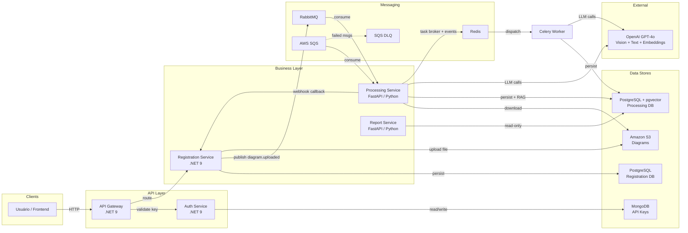
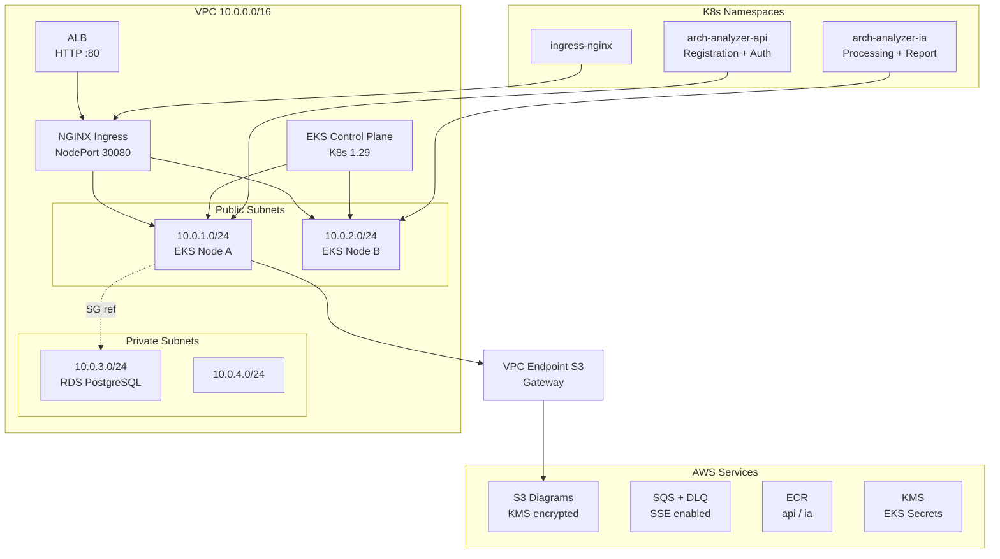
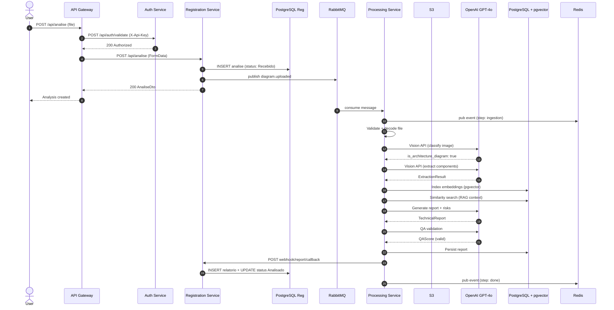
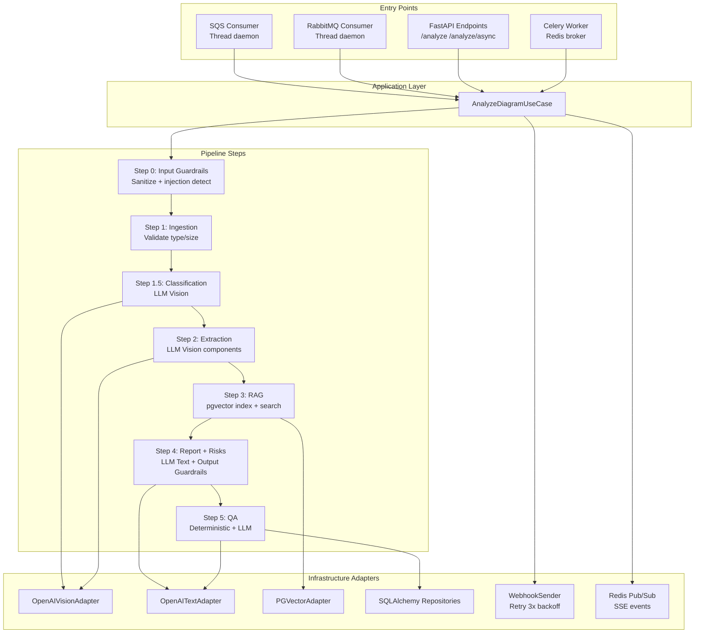
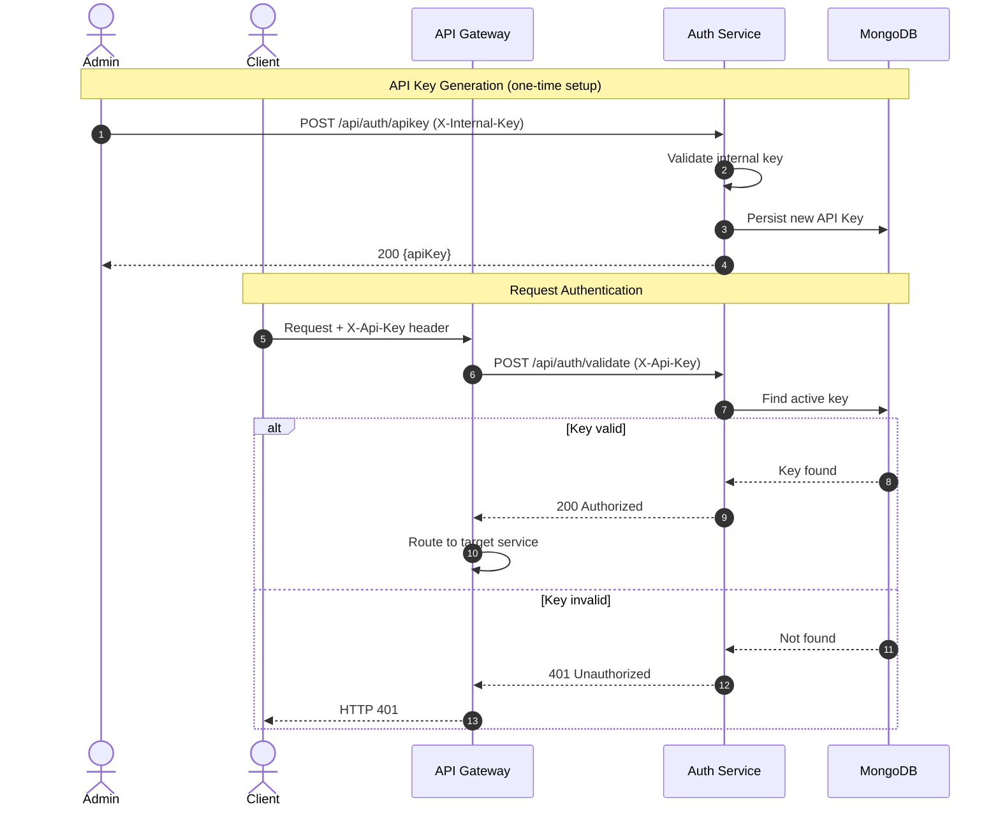
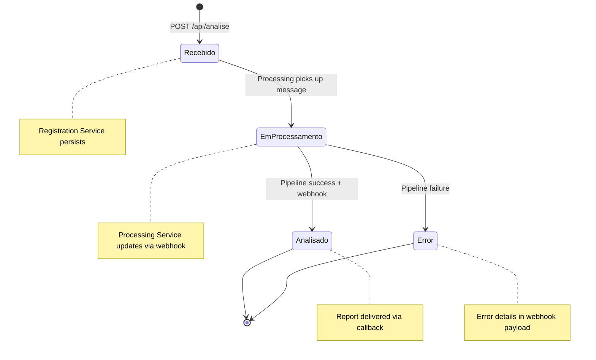
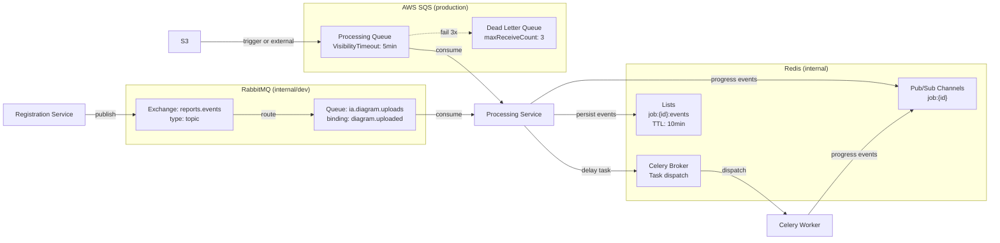
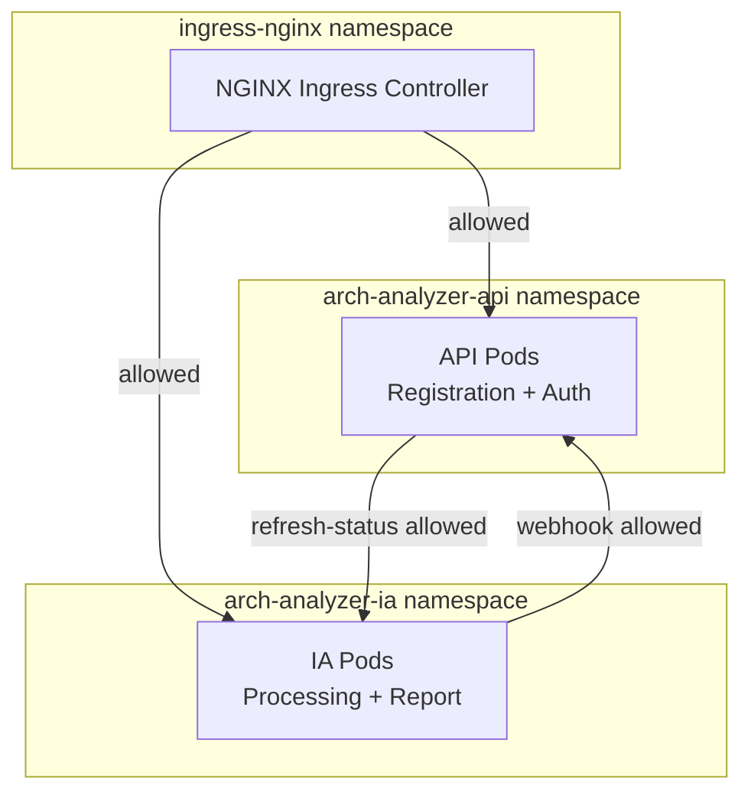
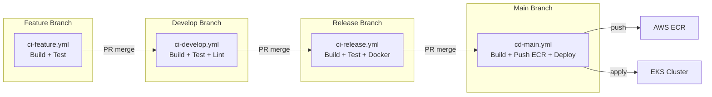

# Arch Analyzer - Infrastructure as Code

Monorepo de infraestrutura Terraform para o projeto **Arch Analyzer**, projetado para rodar no **AWS Academy** com **Amazon EKS**.

---

## Sumário Arquitetural

- **Tipo de sistema:** Microserviços event-driven (6 repos, multi-linguagem)
- **Componentes principais:** API Gateway (.NET), Auth Service (.NET/MongoDB), Registration Service (.NET/PostgreSQL), Processing Service (Python/FastAPI), Report Service (Python/FastAPI), Infra (Terraform/AWS)
- **Infraestrutura:** AWS EKS, RDS PostgreSQL 15, pgvector, MongoDB, RabbitMQ, SQS+DLQ, S3, Redis, ALB, NGINX Ingress, ECR, VPC c/ subnets públicas+privadas
- **Fluxos críticos:** Upload diagrama → RabbitMQ/SQS → Pipeline IA (5 etapas LLM) → Webhook callback → Persistência relatório
- **Padrões identificados:** Clean Architecture, Hexagonal Architecture, CQRS, DDD, Event-Driven, API Gateway, Webhook, RAG, Pub/Sub SSE

---

## Diagramas de Arquitetura

### 1. Topologia Macro — Serviços e Integrações

Visão de alto nível de todos os serviços, bancos, filas e integrações externas.



---

### 2. Topologia de Infraestrutura — AWS EKS

Layout cloud: VPC, subnets, EKS, RDS e serviços de suporte.



---

### 3. Fluxo Principal — Pipeline de Análise de Diagramas

Sequência end-to-end do upload até entrega do relatório.



---

### 4. Arquitetura Interna — Processing Service

Camadas hexagonais e estágios do pipeline dentro do processing-service.



---

### 5. Fluxo de Autenticação

Geração e validação de API Keys.



---

### 6. Máquina de Estados — Ciclo de Vida da Análise

Transições de status de uma análise entre serviços.



---

### 7. Topologia de Mensageria — RabbitMQ + SQS + Redis

Todos os canais de comunicação assíncrona, exchanges, filas e padrões.



---

### 8. Network Policies — Kubernetes

Regras de comunicação inter-namespace gerenciadas pelo módulo Terraform k8s-config.



---

### 9. Pipeline CI/CD

Padrão de workflows GitHub Actions compartilhado entre todos os repos.



---

## Arquitetura da VPC

```
┌─────────────────────────────────────────────────────────────────────┐
│                          VPC (10.0.0.0/16)                          │
│                                                                      │
│  ┌─────────────────────┐       ┌─────────────────────┐              │
│  │ Public Subnet A      │       │ Public Subnet B      │             │
│  │ (10.0.1.0/24)       │       │ (10.0.2.0/24)       │             │
│  │ ┌──────────────────┐│       │ ┌──────────────────┐ │             │
│  │ │ EKS Node (ASG)   ││       │ │ EKS Node (ASG)   │ │             │
│  │ └──────────────────┘│       │ └──────────────────┘ │             │
│  └─────────────────────┘       └─────────────────────┘              │
│            │                            │                            │
│            └──────────┬─────────────────┘                            │
│                    ┌──▼──┐                                           │
│                    │ ALB │ ← HTTP :80                                │
│                    └─────┘                                           │
│                                                                      │
│              ┌────────────────────────┐                               │
│              │ EKS Control Plane      │ (gerenciado pela AWS)        │
│              │ (API Server, etcd)     │                               │
│              └────────────────────────┘                               │
│                                                                      │
│  ┌─────────────────────┐       ┌─────────────────────┐              │
│  │ Private Subnet A     │       │ Private Subnet B     │             │
│  │ (10.0.3.0/24)       │       │ (10.0.4.0/24)       │             │
│  │ ┌──────────────────┐│       │                      │             │
│  │ │ RDS PostgreSQL   ││       │                      │             │
│  │ │ (db.t3.micro)    ││       │                      │             │
│  │ └──────────────────┘│       │                      │             │
│  └─────────────────────┘       └─────────────────────┘              │
│                                                                      │
│  S3 (diagramas) ─── VPC Endpoint S3 Gateway                         │
│  SQS + DLQ (processamento de análises)                               │
└─────────────────────────────────────────────────────────────────────┘
```

---

## Fluxo da Aplicação

1. **Upload de diagramas** → API Cadastro recebe → Upload para S3 → Envia mensagem para SQS/RabbitMQ
2. **Processamento IA** → Serviço IA consome fila → Baixa diagramas do S3 → Pipeline 5 etapas com LLM + RAG
3. **Webhook de retorno** → IA envia relatório via webhook → Registration Service atualiza status
4. **Tratamento de erros** → DLQ captura mensagens falhadas → Consumer de erros atualiza status

---

## Estrutura do Projeto

```
arch-analyzer-infra/
├── main.tf                          # Orquestração dos módulos
├── variables.tf                     # Variáveis globais
├── outputs.tf                       # Outputs globais
├── provider.tf                      # Provider AWS + versões
├── terraform.tfvars.example         # Exemplo de variáveis
│
├── modules/
│   ├── network/                     # VPC, subnets, route tables, VPC endpoints
│   ├── security/                    # Security Groups (ALB, EKS nodes, RDS)
│   ├── storage/                     # S3 buckets (diagramas + access logs)
│   ├── messaging/                   # SQS processing queue + DLQ
│   ├── database/                    # RDS PostgreSQL 15
│   ├── ecr/                         # Container registries
│   ├── eks/                         # EKS cluster + managed node group + addons
│   ├── alb/                         # Application Load Balancer
│   └── k8s-config/                  # Namespaces, NetworkPolicies, ConfigMaps, NGINX Ingress
│
└── examples/
    ├── app-repo-api/                # Exemplo: repo da API Cadastro (Kustomize)
    └── app-repo-ia/                 # Exemplo: repo do Serviço IA (Kustomize)
```

---

## Modelo Multi-Repo

| Repositório | Conteúdo | Responsabilidade |
|---|---|---|
| `arch-analyzer-infra` (este) | Terraform + K8s config | Infraestrutura AWS |
| `arch-analyzer-api-gateway` | ASP.NET Core | Roteamento + entry point |
| `arch-analyzer-auth-service` | .NET 9 + MongoDB | Autenticação (API Keys) |
| `arch-analyzer-registration-service` | .NET 9 + PostgreSQL | Cadastro + ciclo de vida |
| `arch-analyzer-processing-service` | Python + FastAPI | Pipeline IA (LLM + RAG) |
| `arch-analyzer-report-service` | Python + FastAPI | Consulta de relatórios (read-only) |

---

## Segurança

### Implementado
- **EKS Secrets Encryption**: KMS key dedicada com rotação automática
- **EKS Control Plane Logs**: API, audit e authenticator logs habilitados
- **S3**: versioning, KMS encryption, block public access, deny insecure transport
- **SQS**: SSE habilitado, deny insecure transport
- **RDS**: storage encrypted, IAM auth, private subnet, audit logs
- **Security Groups**: princípio do menor privilégio (SG referenciando SGs)
- **NetworkPolicies K8s**: default-deny-ingress + allow explícito
- **VPC Flow Logs**: auditoria de tráfego
- **VPC Endpoint S3**: policy restritiva
- **Pod Security**: runAsNonRoot, runAsUser 10000, readOnlyRootFilesystem, drop ALL capabilities

### Limitações (AWS Academy)
- **ALB HTTP only**: sem HTTPS (ACM pode não estar disponível)
- **LabRole**: IAM role pré-existente do Academy para EKS e nodes
- **RDS single-AZ**: sem Multi-AZ (custo)
- **Nodes em subnets públicas**: evita NAT Gateway (~$32/mês)

---

## Estimativa de Custos

| Recurso | Especificação | Custo Estimado/mês |
|---|---|---|
| EKS Control Plane | Gerenciado | ~$73 |
| EC2 EKS Nodes (x2) | t3.small | ~$30 |
| RDS PostgreSQL | db.t3.micro, single-AZ | ~$13 |
| ALB | HTTP listener | ~$16 |
| S3 + SQS | Uso moderado | ~$2 |
| **Total estimado** | | **~$134/mês** |

---

## Quick Start

```bash
# 1. Configure as variáveis
cp terraform.tfvars.example terraform.tfvars

# 2. Inicialize o Terraform
terraform init

# 3. Verifique o plano
terraform plan

# 4. Aplique a infraestrutura
terraform apply

# 5. Configure o kubeconfig
aws eks update-kubeconfig --region us-east-1 --name $(terraform output -raw eks_cluster_name)
```

---

## Outputs do Terraform

| Output | Descrição |
|---|---|
| `eks_cluster_name` | Nome do cluster EKS |
| `eks_cluster_endpoint` | URL do API server EKS |
| `alb_dns_name` | URL de acesso à aplicação |
| `db_endpoint` | Endpoint do RDS |
| `s3_diagrams_bucket` | Nome do bucket S3 |
| `sqs_processing_queue_url` | URL da fila SQS |
| `kubeconfig_command` | Comando para configurar kubectl |
